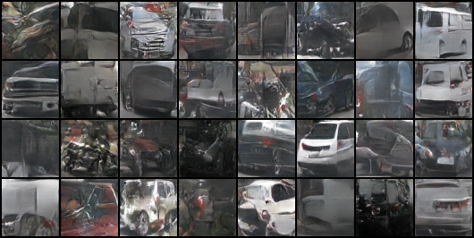

# AutoDoppelGANger
## Further Development
>Old version. All further development will be conducted in [AutoDoppelGANger-GOLEM](https://github.com/AtarSander/AutoDoppelGANger-GOLEM) repository.
## Summary
AutoDoppelGANger is a DCGAN model trained to generate images of cars based on photos from NuImages dataset. The model was created with the execution of a full machine learning pipelining, from data collection to validation and evaluation of model results. Core elements of the project:
- Data gathering(cutting out cars images from NuImages dataset)
- Dataset analysis
- Data labeling
- Data augmentation
- Implementation of DCGAN network
- Evaluation
## Dataset
Original source of the data is [NuImages](https://www.nuscenes.org/nuimages) dataset. It consists of 93,000 2d annotated images, intended for autonomous driving. However our target was generating cars images, yet NuImages pictures included the road and all the surroundings. So in order to create the dataset we needed, we had to cut out pictures of cars from nuimages based on their annotated bounding boxes. 
The dataset included photos of cars from various directions, in addition to photos of bicycles, motorcycles and mislabeled ones. After training on these images it turned out that they were too diverse for the model to learn how to generate accurate car images. 

 
Solution to this problem was semi-automated (with labeling_script.sh) hand-labeling cars images into three categories:
- front
- side
- back
In this way, we created the final version of the dataset.
## Tech stack
| Category | Library |
|----------|----------|
| Deep Learning | PyTorch, numpy |
| Image processing | OpenCV-python |
| Dataset handling | Nuscenes-devkit, pandas |
| Data analyzing | pandas |
| Visualisation | Matplotlib |
| Evaluation | Scipy |
## License
This project is licensed under the terms of the [MIT license](https://opensource.org/licenses/MIT).
## Authors
@AtarSander @mikorozek
